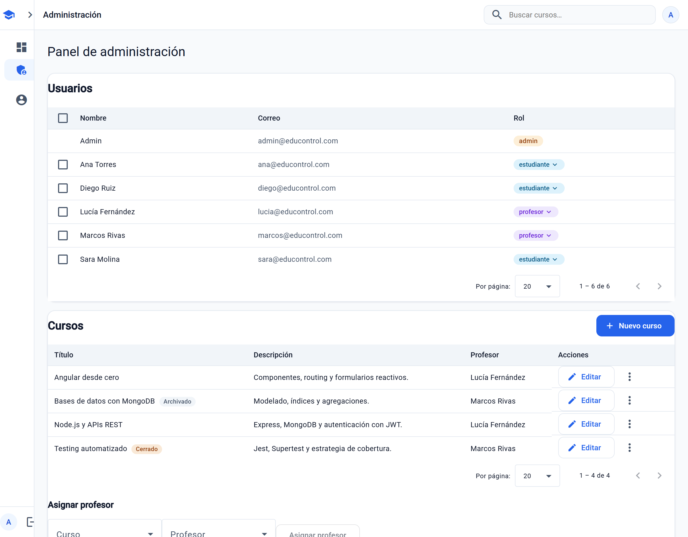
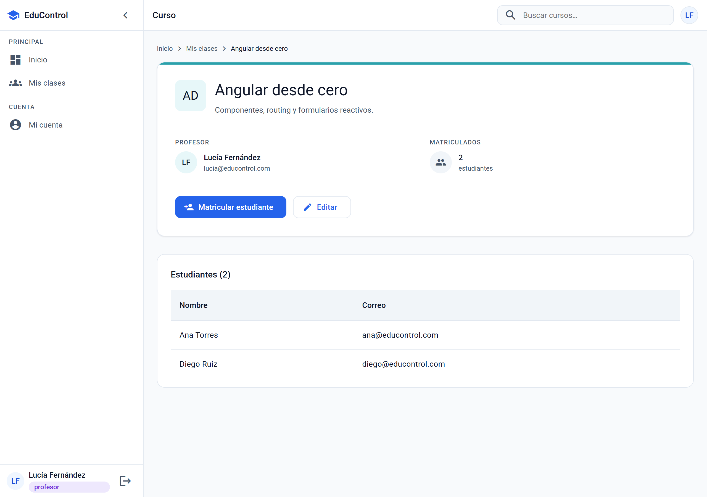
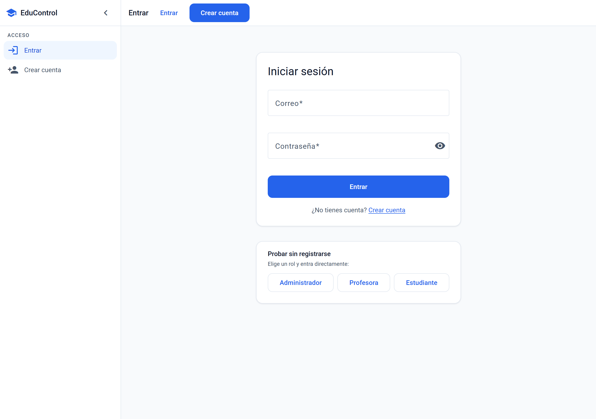
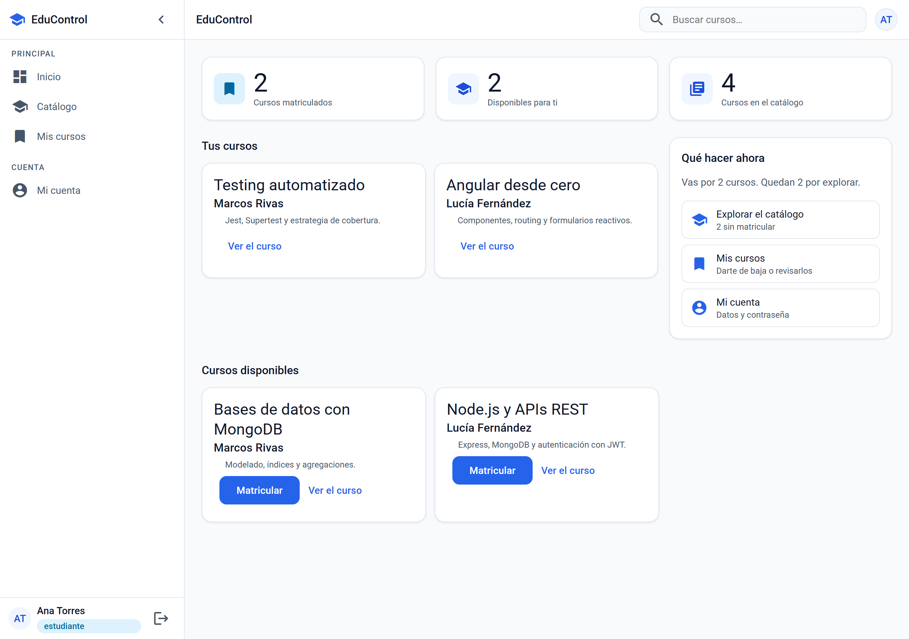
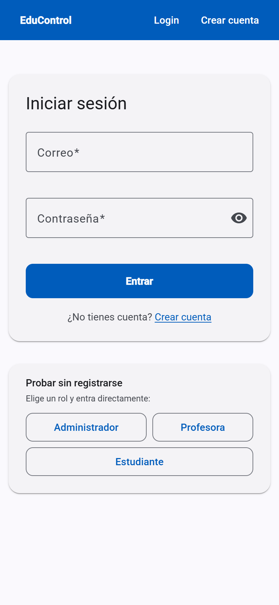
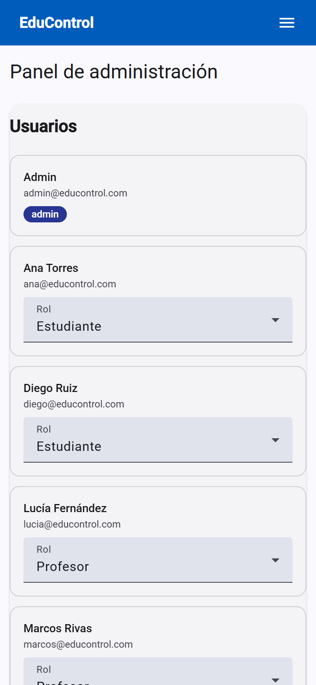

# EduControl

Plataforma de gestión de cursos, estudiantes y profesores. Angular 20 en el frontend, Express y MongoDB en el backend, con autenticación JWT y autorización por roles.




Todo enlace a un curso acaba en su ficha, con las acciones que le tocan a cada rol y la lista de matriculados solo para quien lo imparte o administra:



<p align="center">
  
  
</p>

En móvil las tablas se convierten en tarjetas y la navegación pasa a un menú desplegable, en vez de encoger el diseño de escritorio:

<p align="center">
  
  
</p>

---

## Arrancarlo

```bash
npm run install:all && npm run serve
```

Y abre <http://localhost:3000>. No hace falta instalar MongoDB: si no encuentra una base de datos, el servidor levanta una en memoria y la siembra con datos de ejemplo.

Un solo proceso sirve la API y la aplicación web desde el mismo origen, así que no hay CORS ni URLs absolutas que configurar.

### Entrar

La portada y la pantalla de login tienen un botón por rol que entra directamente. Si prefieres escribirlas:

| Rol           | Correo                 | Contraseña  |
| ------------- | ---------------------- | ----------- |
| Administrador | `admin@educontrol.com` | `Admin123*` |
| Profesora     | `lucia@educontrol.com` | `Demo1234`  |
| Estudiante    | `ana@educontrol.com`   | `Demo1234`  |

### Desarrollo

```bash
npm run dev:api    # API con recarga en caliente, puerto 3000
npm run dev:web    # Angular dev server con proxy a la API, puerto 4200
```

---

## Qué hace

- **Administrador** — gestiona usuarios y sus roles, crea y edita cursos, asigna profesores y matricula estudiantes.
- **Profesor** — consulta los cursos que imparte, ve quién está matriculado y matricula a alguien por su correo.
- **Estudiante** — busca en el catálogo, se matricula y ve sus cursos.

Todos los caminos acaban en la **ficha del curso** (`/cursos/:id`): título,
descripción, profesor, cuántos hay matriculados y las acciones que le tocan a
cada rol. La lista de matriculados solo la ve quien imparte el curso o
administra; un estudiante sabe cuántos son, no quiénes.

## Stack

| Capa          | Tecnología                                                   |
| ------------- | ------------------------------------------------------------ |
| Frontend      | Angular 20 (standalone components), Angular Material 3, RxJS |
| Backend       | Node.js, Express 5, Mongoose 8                               |
| Base de datos | MongoDB (o en memoria para desarrollo)                       |
| Autenticación | JWT, contraseñas con bcrypt                                  |
| Tests         | Jest + Supertest (backend), Karma + Jasmine (frontend)       |

## Estructura

```
backend/
  app.js         la aplicación Express: middlewares, rutas, 404, errores
  server.js      arranque del proceso: conectar, sembrar, escuchar
  static.js      servido de la SPA y cabeceras de caché
  config/        entorno, conexión a Mongo, Mongo en memoria, seed del admin
  controllers/   lógica de cada recurso
  middlewares/   validateJWT, roleCheck, validación de campos, errores
  models/        esquemas de Mongoose
  routes/        endpoints y sus validadores
  utils/         clave de profesor, paginación, generación de JWT
  scripts/       datos de demostración
  __tests__/     119 tests, incluidos los de regresión de seguridad

frontend/src/app/
  core/          sesión, guards, interceptor, errores HTTP, rutas por rol
  data/          el contrato con el backend: un servicio por recurso,
                 modelos y el mapper nombre↔titulo
  features/      una carpeta por área: landing, auth, cuenta,
                 admin, profesor, estudiante
  shared/        navbar, diálogos, estado-vista, módulo de Material
```

`app.js` no conecta a la base ni llama a `listen()`: eso vive en `server.js`. Los tests importan `app` para Supertest y no deben provocar conexiones.

---

## Calidad

```bash
npm run lint          # ESLint en backend y frontend
npm run lint:fix      # y que arregle lo que sepa arreglar
npm run format        # Prettier sobre todo el repositorio
npm run format:check  # sin escribir: solo dice qué no está formateado
```

Cada push y cada pull request pasan por `.github/workflows/ci.yml`: lint,
formato, los tests del backend con cobertura y los del frontend en Chrome sin
interfaz, más el build de producción.

Dos reglas de ESLint están como aviso y no como error, porque su deuda es
anterior: `no-explicit-any` (usos heredados) y `prefer-inject` (27 componentes
que aún inyectan por constructor). El script de lint del frontend lleva
`--max-warnings=59`, el número exacto de hoy: los avisos solo pueden bajar, y
cualquier `any` nuevo rompe la build.

---

## Tests

```bash
npm test        # backend: 202 tests (Jest + Supertest)
npm run test:web  # frontend: 29 tests (Karma + Jasmine)
```

Cobertura del backend, medida con `npm run test:cov`: **85,7 % sentencias · 76,9 % ramas · 97,8 % funciones · 87,1 % líneas**. Los umbrales de `jest.config.js` van medio punto por debajo de esas cifras, no muy por debajo: un umbral que va por detrás de lo que realmente se cubre no protege de nada.

El backend cubre el CRUD completo, la validación de payloads, el manejo de errores y **la autorización**. Este último bloque nació de dos auditorías del propio proyecto: siete fallos de control de acceso, y cada arreglo fijado con tests de regresión que fallan contra el código anterior.

| Comprobación                                            | Resultado esperado                    |
| ------------------------------------------------------- | ------------------------------------- |
| `DELETE /api/admin/purge` sin token                     | 401                                   |
| `DELETE /api/admin/purge` con token de estudiante       | 403                                   |
| `POST /api/admin/seed-admin` sobre una cuenta existente | no la modifica                        |
| `POST /api/usuarios` con `rol: admin`                   | 400                                   |
| `PUT /api/usuarios/:id` de un tercero                   | 403, sin efecto                       |
| Auto-ascenso a profesor sin clave                       | 403                                   |
| Cambiar la propia contraseña sin indicar la actual      | 400                                   |
| Cambiarla con una contraseña actual equivocada          | 403, la antigua sigue valiendo        |
| `?limit=999999` en un listado                           | recortado al máximo permitido         |
| `PUT`/`DELETE /api/cursos/:id` de un curso ajeno        | 403, el curso intacto                 |
| `GET /api/inscripciones` como estudiante                | solo las suyas, sin correos ajenos    |
| `GET /api/inscripciones?curso=` de un curso ajeno       | lista vacía, no 403 explicativo       |
| `GET /api/inscripciones/:id` de una matrícula ajena     | 404, ni confirma que existe           |
| `DELETE` de un curso o un estudiante                    | se van también sus inscripciones      |
| `DELETE` de un profesor con cursos                      | 409 diciendo cuántos, sin borrar nada |
| Login con correo inexistente vs. contraseña mala        | misma respuesta, palabra por palabra  |
| Sexto intento fallido de login                          | 429                                   |
| `CastError` y `E11000` que llegan al manejador          | 400 y 409, sin texto de Mongo         |
| Cabecera legacy `x-token`                               | 401: solo vale `Authorization`        |
| `DELETE /api/inscripciones/:id` de una matrícula ajena  | 403, sigue matriculado                |
| `?buscar=C++` en el catálogo                            | texto literal, no patrón              |
| Dos correos que solo difieren en mayúsculas             | colisionan: es la misma cuenta        |
| Matricular en un curso inexistente                      | 404, no se crea nada                  |
| Matricular a un profesor o a un admin                   | 400                                   |
| Dos matrículas iguales a la vez                         | una 201 y otra 400, nunca un 500      |

Los tests no solo comprueban el código de estado: verifican también que el efecto no ocurrió. Tras un 403 al intentar cambiar la contraseña del administrador, la contraseña original sigue siendo válida y la del atacante no.

---

## Seguridad

Decisiones que conviene conocer si vas a desplegarlo:

- **Las rutas destructivas no existen en producción.** `/api/admin/purge` y `/api/admin/seed-admin` solo se montan si `NODE_ENV` es `development` o `test`. La comprobación es _fail-closed_: si la variable no está definida, se asume producción. Devuelven 404, no 403, para no confirmar que la ruta existe.
- **El registro público solo crea estudiantes o profesores.** El rol nunca se toma del cuerpo de la petición sin filtrar. Un administrador solo se crea desde el servidor, con `ADMIN_EMAIL` y `ADMIN_PASSWORD`.
- **Ascender a profesor exige `PROFESOR_CLAVE`.** Si la variable no está configurada, nadie puede auto-asignarse el rol: solo lo concede un administrador.
- **La autorización lee el rol de la base de datos, no del token.** Un usuario degradado pierde el acceso de inmediato en lugar de conservarlo hasta que caduque su JWT.
- **Sin `ADMIN_PASSWORD` no se siembra el administrador en producción**, para no crear una cuenta con contraseña conocida.
- **Cambiar la propia contraseña exige la actual.** Una sesión olvidada abierta no basta para quedarse la cuenta. Un administrador sí puede restablecer la de otra persona: eso es una acción administrativa, no un cambio propio.
- **El login no dice qué ha fallado.** Un correo que no existe y una contraseña equivocada devuelven el mismo 401 con el mismo texto. Cuando el correo no existe se compara igualmente contra un hash señuelo: `bcrypt.compare` tarda a propósito, y saltarse esa espera delata qué correos están registrados aunque el mensaje sea idéntico.
- **El login admite cinco intentos fallidos cada quince minutos**, contados por IP y correo a la vez. Solo por IP, un aula entera detrás del mismo router se bloquea sola; solo por correo, cualquiera deja fuera a quien quiera. Acertar no consume intentos.
- **Cabeceras de seguridad con `helmet`.** La CSP permite estilos en línea —Material los escribe en tiempo de ejecución— pero no scripts, y `frame-ancestors 'none'` impide incrustar la aplicación en un iframe ajeno.
- **Sin CORS.** El backend sirve su propio frontend desde el mismo origen, así que permitir orígenes cruzados no aportaba nada y sí superficie.
- **Los errores no enseñan las tripas.** `CastError` sale como 400 "Identificador no válido" y `E11000` como 409 "Ese valor ya existe", en vez del mensaje de Mongo con el nombre de la colección y del índice dentro. En producción, cualquier 500 sale genérico y el detalle se queda en el log.
- **El rol autoriza, y la propiedad también.** `roleCheck` dice qué clase de usuario puede entrar por una ruta; de quién es el recurso lo decide el controlador. Un profesor edita y borra sus cursos, no los de sus compañeros; el administrador, cualquiera.
- **Cada quien lista lo suyo.** `GET /api/inscripciones` filtra en el servidor según quién pregunta: un estudiante recibe sus matrículas, un profesor las de los cursos que imparte y un administrador todas. Los filtros `?curso=` y `?estudiante=` se cruzan con esa regla y nunca la amplían. Pedir una matrícula ajena por su id devuelve 404, no 403: quien no puede verla tampoco tiene por qué saber que existe.
- **Los borrados no dejan huérfanos.** Borrar un curso se lleva sus inscripciones; borrar un estudiante, las suyas. Borrar un profesor que imparte cursos devuelve **409** diciendo cuántos son: hacerlo en cascada destruiría las matrículas de todos sus alumnos sin avisar, así que primero hay que reasignar.
- **Los listados están paginados y con un tope duro** (100 por página). Sin ese tope, `?limit=999999` reintroduce desde fuera el problema que la paginación viene a evitar.

### Variables de entorno

Copia `backend/.env.example` a `backend/.env`. En desarrollo todas tienen valor por defecto y el servidor avisa por consola de cuáles está inventando.

| Variable                         | Para qué                                            |
| -------------------------------- | --------------------------------------------------- |
| `MONGO_URI`                      | Conexión a MongoDB. Sin ella, base en memoria.      |
| `JWT_SECRET`                     | Firma de los tokens. **Obligatoria en producción.** |
| `JWT_EXPIRES_IN`                 | Duración del token. Por defecto, 12 h.              |
| `PROFESOR_CLAVE`                 | Clave para ascender a profesor.                     |
| `ADMIN_EMAIL` / `ADMIN_PASSWORD` | Administrador inicial.                              |

---

## Diseño

Dirección **A — «consola académica»**: neutros fríos, acento contenido, densidad
real y modo oscuro. Va encima de Angular Material 3, no en su lugar: los tokens
propios reapuntan las variables `--mat-sys-*`, así que las tablas, los diálogos y
el paginador siguen la paleta sin tocarlos uno a uno.

El vocabulario completo —superficies, texto, acento, roles, estado, radios y
sombras, con su valor en claro y en oscuro— está en
[docs/DISENO.md](docs/DISENO.md).

Cero colores literales fuera de `styles.scss`, y contraste **AA comprobado en las
ocho pantallas y en los dos modos**, midiendo cada texto contra su fondo real.

---

## Rendimiento

Medido antes y después de la pasada de agosto de 2026. El bundle sale de
`npm run build`; las peticiones, de una carga limpia de `/admin` en el
navegador; Lighthouse, en modo escritorio contra `/login`, que es la única
ruta que puede visitar sin sesión.

| Medida                             | Antes  | Después   |
| ---------------------------------- | ------ | --------- |
| Bundle inicial (crudo)             | 770 kB | 700,33 kB |
| Bundle inicial (transferido, gzip) | 189 kB | 172,75 kB |
| Peticiones al abrir `/admin`       | 7      | 5         |
| Lighthouse `/login` — puntuación   | 99     | 98-99     |
| Lighthouse `/login` — LCP          | 0,9 s  | 0,9-1,1 s |
| Lighthouse `/login` — TBT          | 50 ms  | 10-40 ms  |

Sobre Lighthouse: la diferencia está dentro del ruido de la máquina —tres
ejecuciones seguidas del mismo build dan 98-99, 0,9-1,1 s y 10-40 ms—, y era
de esperar: ninguno de los cambios toca la pantalla de login. Lo que sí se
mueve es el panel de administración, y ahí Lighthouse no llega porque hace
falta sesión.

### La portada

Medida igual, contra `/`, que ahora es una pantalla de verdad y no un texto
centrado:

| Medida                 | Escritorio | Móvil     |
| ---------------------- | ---------- | --------- |
| Rendimiento            | 95         | 57-75     |
| Accesibilidad          | 100        | 100       |
| Prácticas recomendadas | 100        | 100       |
| SEO                    | 100        | 100       |
| LCP                    | 1,3 s      | 4,0-5,0 s |
| CLS                    | 0          | 0         |

El objetivo era 90 de rendimiento: se cumple en escritorio y no en móvil. El
motivo no está en la portada. Con la CPU cuatro veces más lenta y la red de un
4G malo, lo que manda es el bundle inicial —Angular con Material— y la hoja de
estilos, que bloquea el pintado porque `inlineCritical` está desactivado por la
CSP. La portada pone 14,6 kB de chunk propio y 44 kB de captura; el resto lo
paga igual cualquier otra ruta. Bajarlo es otro trabajo, no un retoque de esta
pantalla.

Lo que sí se midió y se corrigió aquí: la captura del héroe pasó de 250 kB (PNG
a escala 2) a 44 kB (webp a escala 1) sin perder nitidez —en su hueco más ancho
se pinta a unos 570 px—, y `/robots.txt` dejó de caer en el comodín del
enrutado, que se lo devolvía como index.html.

De dónde salen los 70 kB: se fueron `@angular-devkit/build-angular`,
`@angular/platform-browser-dynamic` y `express` del frontend, y con ellos 300
paquetes transitivos.

Lo que **no** se hizo, con la medición delante: se probó `@defer` sobre la
sección de "asignar profesor" del panel. El bloque diferido no saca nada del
chunk del panel —todo lo que usa ya está dentro por la tabla— y a cambio mete
el motor de `@defer` en el bundle inicial, que paga todo el mundo, incluida la
portada: 700,33 kB sin él contra 707,38 kB con él. Diferir tiene sentido
cuando aparta código, no cuando solo retrasa un render.

Otras decisiones que se ven en el código:

- El texto de los botones de la tabla lo esconde una **consulta de contenedor**,
  no un método de TypeScript que lea `window.innerWidth` una vez por fila y por
  ciclo de detección.
- Todos los `@for` llevan `track` por identificador estable.
- El backend sirve con `compression`: el chunk mayor pasa de 165 kB a 55 kB por
  el cable.

---

## Limitaciones conocidas

Escrito a propósito: son cosas detectadas y priorizadas, no sorpresas.

- **No hay recuperación de contraseña.** Si un usuario la olvida, solo un administrador puede restablecérsela.
- **Los desplegables de profesor y estudiante cargan como mucho 100 opciones.** Por encima de eso harían falta un buscador con filtro en servidor.
- **`POST /api/inscripciones` acepta el `estudianteId` (o el `correo`) del cuerpo sin comprobar de quién es.** Lo necesitan el panel de administración y la ficha del curso para matricular a terceros, pero un estudiante autenticado también podría matricular a otro. La regla correcta sería: admin y profesor matriculan a quien sea, un estudiante solo a sí mismo.
- **El profesor matricula escribiendo un correo, no eligiendo de una lista.** `GET /api/usuarios` es solo de administrador y abrirlo a los profesores repartiría el nombre y el correo de todos los estudiantes del centro. Un buscador que resuelva por prefijo en el servidor sería mejor, pero es otra pieza.
- **El bundle inicial pesa ~733 kB** (180 kB transferidos). Es lo que cuesta Angular con Material; el presupuesto del build está en 800 kB para que avise de regresiones reales en vez de saltar siempre. Los números, en la sección de rendimiento.

## Licencia

ISC
