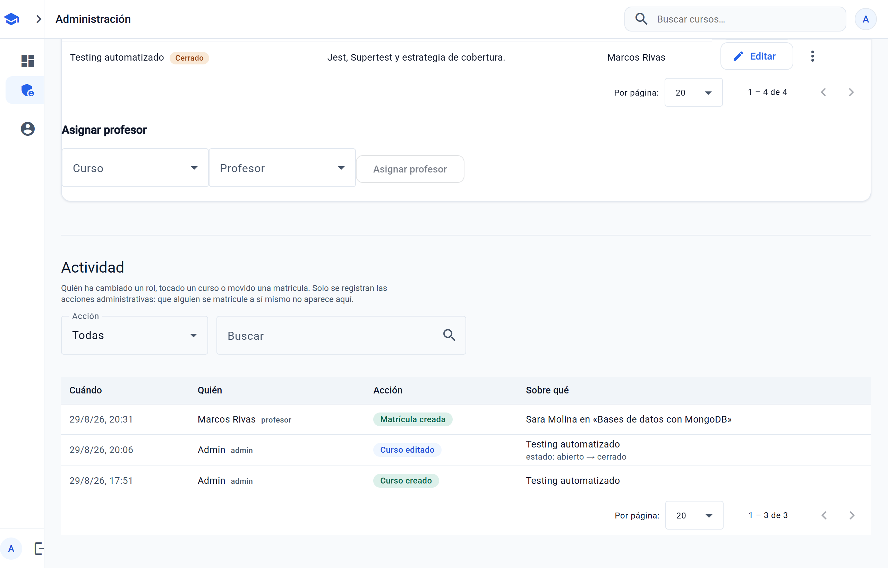
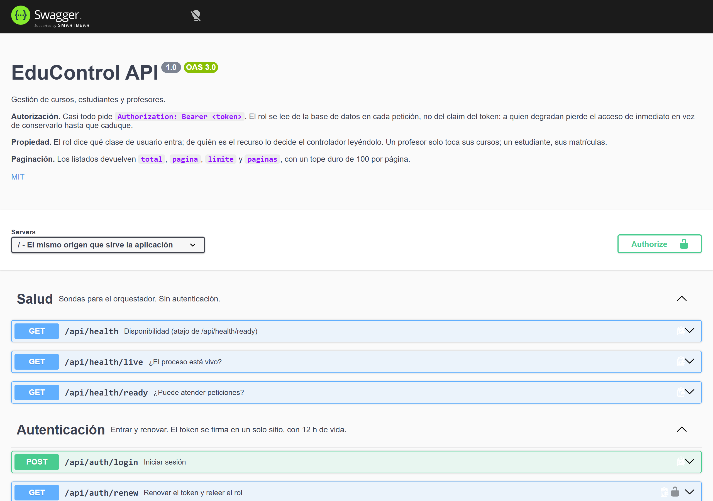

# EduControl

Plataforma de gestión de cursos, estudiantes y profesores. Angular 20 en el frontend, Express y MongoDB en el backend, con autenticación JWT y autorización por roles.


Todo enlace a un curso acaba en su ficha, con las acciones que le tocan a cada rol y la lista de matriculados solo para quien lo imparte o administra:


<p align="center">
  
  
</p>

En móvil las tablas se convierten en tarjetas y la navegación pasa a un menú desplegable, en vez de encoger el diseño de escritorio:

<p align="center">
  
  
</p>

---

## Arrancarlo

```bash
npm run install:all && npm run serve
```

Y abre <http://localhost:3000>. No hace falta instalar MongoDB: si no encuentra una base de datos, el servidor levanta una en memoria y la siembra con datos de ejemplo.

Un solo proceso sirve la API y la aplicación web desde el mismo origen, así que no hay CORS ni URLs absolutas que configurar.

Eso es para mirarlo. Para **desplegarlo** hay Docker: `docker compose up -d --build`, con MongoDB persistente y apagado ordenado — está en [Despliegue](#despliegue).

### Entrar

La portada y la pantalla de login tienen un botón por rol que entra directamente. Si prefieres escribirlas:

| Rol           | Correo                 | Contraseña  |
| ------------- | ---------------------- | ----------- |
| Administrador | `admin@educontrol.com` | `Admin123*` |
| Profesora     | `lucia@educontrol.com` | `Demo1234`  |
| Estudiante    | `ana@educontrol.com`   | `Demo1234`  |

### Desarrollo

```bash
npm run dev:api    # API con recarga en caliente, puerto 3000
npm run dev:web    # Angular dev server con proxy a la API, puerto 4200
```

---

## Qué hace

- **Administrador** — gestiona usuarios y sus roles, crea y edita cursos, asigna profesores, matricula estudiantes y revisa el registro de actividad.
- **Profesor** — consulta los cursos que imparte, ve quién está matriculado, matricula a alguien por su correo y exporta la lista a CSV.
- **Estudiante** — busca en el catálogo, se matricula y ve sus cursos.

Todos los caminos acaban en la **ficha del curso** (`/cursos/:id`): título,
descripción, profesor, cuántos hay matriculados y las acciones que le tocan a
cada rol. La lista de matriculados solo la ve quien imparte el curso o
administra; un estudiante sabe cuántos son, no quiénes.

Un curso tiene **plazas** y **estado**. Con cupo, la ficha dice «12 / 30
plazas»; sin plazas o con el curso cerrado, el botón de matricularse se apaga
**con el motivo al lado** —un botón muerto sin explicación deja a la gente
probando a pulsarlo— y el servidor devuelve 409 por si alguien lo intenta por su
cuenta. Archivar saca el curso del catálogo del estudiante, no del panel de
administración: archivar no es borrar.

Y todo lo que hace administración queda registrado:



## Stack

| Capa          | Tecnología                                                   |
| ------------- | ------------------------------------------------------------ |
| Frontend      | Angular 20 (standalone components), Angular Material 3, RxJS |
| Backend       | Node.js, Express 5, Mongoose 8                               |
| Base de datos | MongoDB (o en memoria para desarrollo)                       |
| Autenticación | JWT, contraseñas con bcrypt                                  |
| Tests         | Jest + Supertest, Karma + Jasmine, Playwright (e2e)          |
| Despliegue    | Docker multietapa, docker-compose, OpenAPI 3                 |

## Estructura

```
backend/
  app.js         la aplicación Express: middlewares, rutas, 404, errores
  server.js      arranque del proceso: conectar, sembrar, escuchar
  static.js      servido de la SPA y cabeceras de caché
  config/        entorno, conexión a Mongo, Mongo en memoria, seed del admin
  controllers/   lógica de cada recurso
  middlewares/   validateJWT, roleCheck, validación de campos, errores
  models/        esquemas de Mongoose
  routes/        endpoints y sus validadores
  utils/         clave de profesor, paginación, generación de JWT
  scripts/       datos de demostración
  docs.js        Swagger UI en /api/docs, solo fuera de producción
  openapi.yaml   el contrato de la API, escrito a mano y comprobado con un test
  __tests__/     341 tests, incluidos los de regresión de seguridad

frontend/src/app/
  core/          sesión, guards, interceptor, errores HTTP, rutas por rol
  data/          el contrato con el backend: un servicio por recurso,
                 modelos y el mapper nombre↔titulo
  features/      una carpeta por área: landing, auth, cuenta,
                 admin, profesor, estudiante, curso
  shared/        navbar, diálogos, estado-vista, descarga de ficheros
  testing/       ayudas para los tests de componente (sembrar sesión)

e2e/             recorridos de extremo a extremo con Playwright

Dockerfile           imagen de producción, en tres etapas
docker-compose.yml   la aplicación y su MongoDB con volumen persistente
.env.example         las variables, con lo que pasa si falta cada una
```

`app.js` no conecta a la base ni llama a `listen()`: eso vive en `server.js`. Los tests importan `app` para Supertest y no deben provocar conexiones.

---

## Calidad

```bash
npm run lint          # ESLint en backend y frontend
npm run lint:fix      # y que arregle lo que sepa arreglar
npm run format        # Prettier sobre todo el repositorio
npm run format:check  # sin escribir: solo dice qué no está formateado
```

Cada push y cada pull request pasan por `.github/workflows/ci.yml`, en cuatro
trabajos: lint y formato, los tests del backend con cobertura, los del frontend
con cobertura y el build de producción, y los recorridos de extremo a extremo.

`no-explicit-any` y `prefer-inject` llevaban tiempo como aviso, con un tope de
58 en el script de lint del frontend. Ya no queda ninguno de los dos: los seis
componentes que inyectaban por constructor usan `inject()`, y los `any` de
producción están tipados —`Sobre`, `CursoCrudo`, `InscripcionCruda`— en vez de
tolerados. Las dos reglas son ahora **error** y el script lleva
`--max-warnings=0`. En los `*.spec.ts`, `no-explicit-any` está apagada: un doble
de test tipado a medias es ruido, no deuda, y contarlo escondía los `any` de
producción, que son los que importan.

---

## Tests

```bash
npm test          # backend:  341 tests (Jest + Supertest)
npm run test:web  # frontend: 220 tests (Karma + Jasmine)
npm run test:e2e  # extremo a extremo: 13 recorridos (Playwright)
```

### Extremo a extremo

`npm run test:e2e` levanta la aplicación entera —`npm run serve`, con Mongo en
memoria y los datos de ejemplo— y la recorre con un navegador de verdad: el
estudiante busca, se matricula y se da de baja; el profesor entra en su clase,
lee la lista de alumnos y exporta el CSV; administración crea un curso, le
asigna profesor, matricula a alguien y lo borra. Y una regresión del control de
acceso: un profesor no ve las acciones de un curso ajeno **ni en la pantalla ni
llamando a la API por su cuenta**.

Van en un solo worker a propósito: los tres roles comparten una única base de
datos y en paralelo se pisarían las matrículas. Ir en serie no es lo mismo que
depender del orden — cada recorrido deja la base como se la encontró, y por eso
se pueden ejecutar sueltos (`npm run test:e2e -- estudiante`). Está comprobado
lanzando la tanda tres veces seguidas contra el mismo servidor.

### Cobertura

Cobertura del backend, medida con `npm run test:cov`: **91,9 % sentencias · 85,5 % ramas · 100 % funciones · 93,0 % líneas**. Los umbrales de `jest.config.js` son 89/82/99/90: entre uno y tres puntos por debajo de lo real, lo bastante cerca para que borrar tests duela y lo bastante lejos para que una variación pequeña no tumbe la integración continua. Un umbral que va por detrás de lo que realmente se cubre no protege de nada, así que se revisan cuando la cobertura sube de verdad.

Cobertura del frontend, con `npm run test:web:cov`: **85,8 % sentencias · 67,8 % ramas · 84,9 % funciones · 87,7 % líneas**, con los umbrales de `frontend/karma.conf.js` (83/65/82/85) un par de puntos por debajo. Las ramas iban en el 47 % y ese era el trabajo pendiente: los dos diálogos de administración no tenían un solo test, la barra de navegación tenía un `should create`, y login, register y tres servicios de datos estaban a cero o casi. Cubrirlos las subió veinte puntos.

El backend cubre el CRUD completo, la validación de payloads, el manejo de errores y **la autorización**. Este último bloque nació de dos auditorías del propio proyecto: siete fallos de control de acceso, y cada arreglo fijado con tests de regresión que fallan contra el código anterior.

| Comprobación                                            | Resultado esperado                     |
| ------------------------------------------------------- | -------------------------------------- |
| `DELETE /api/admin/purge` sin token                     | 401                                    |
| `DELETE /api/admin/purge` con token de estudiante       | 403                                    |
| `POST /api/admin/seed-admin` sobre una cuenta existente | no la modifica                         |
| `POST /api/admin/seed-admin` sin contraseña             | 400, no se inventa ninguna             |
| `POST /api/usuarios` con `rol: admin`                   | 400                                    |
| `PUT /api/usuarios/:id` de un tercero                   | 403, sin efecto                        |
| Auto-ascenso a profesor sin clave                       | 403                                    |
| Cambiar la propia contraseña sin indicar la actual      | 400                                    |
| Cambiar el propio correo sin indicar la actual          | 400, y el correo sigue siendo el viejo |
| Cambiarla con una contraseña actual equivocada          | 403, la antigua sigue valiendo         |
| `?limit=999999` en un listado                           | recortado al máximo permitido          |
| `PUT`/`DELETE /api/cursos/:id` de un curso ajeno        | 403, el curso intacto                  |
| `GET /api/inscripciones` como estudiante                | solo las suyas, sin correos ajenos     |
| `GET /api/inscripciones?curso=` de un curso ajeno       | lista vacía, no 403 explicativo        |
| `GET /api/inscripciones/:id` de una matrícula ajena     | 404, ni confirma que existe            |
| `GET /api/usuarios/:id` de un tercero                   | 404, aunque sea alumno tuyo            |
| `DELETE` de un curso o un estudiante                    | se van también sus inscripciones       |
| `DELETE` de un profesor con cursos                      | 409 diciendo cuántos, sin borrar nada  |
| Degradar o borrar al único administrador que queda      | 409, y sigue siendo admin              |
| `DELETE` de una cuenta                                  | queda en el historial, con su nombre   |
| `POST /api/inscripciones` de un estudiante a otro       | 403, y el otro no queda matriculado    |
| Ídem con el `correo` de un tercero                      | 403 idéntico, exista ese correo o no   |
| `POST /api/inscripciones` de un profesor en curso ajeno | 403, sin matricular a nadie            |
| Login con correo inexistente vs. contraseña mala        | misma respuesta, palabra por palabra   |
| Sexto intento fallido de login                          | 429                                    |
| `CastError` y `E11000` que llegan al manejador          | 400 y 409, sin texto de Mongo          |
| Cabecera legacy `x-token`                               | 401: solo vale `Authorization`         |
| `DELETE /api/inscripciones/:id` de una matrícula ajena  | 403, sigue matriculado                 |
| `?buscar=C++` en el catálogo                            | texto literal, no patrón               |
| Dos correos que solo difieren en mayúsculas             | colisionan: es la misma cuenta         |
| Matricular en un curso inexistente                      | 404, no se crea nada                   |
| Matricular a un profesor o a un admin                   | 400                                    |
| Dos matrículas iguales a la vez                         | una 201 y otra 400, nunca un 500       |

Los tests no solo comprueban el código de estado: verifican también que el efecto no ocurrió. Tras un 403 al intentar cambiar la contraseña del administrador, la contraseña original sigue siendo válida y la del atacante no.

---

## Seguridad

Decisiones que conviene conocer si vas a desplegarlo:

- **Las rutas destructivas no existen en producción.** `/api/admin/purge` y `/api/admin/seed-admin` solo se montan si `NODE_ENV` es `development` o `test`. La comprobación es _fail-closed_: si la variable no está definida, se asume producción. Devuelven 404, no 403, para no confirmar que la ruta existe.
- **El registro público solo crea estudiantes o profesores.** El rol nunca se toma del cuerpo de la petición sin filtrar. Un administrador solo se crea desde el servidor, con `ADMIN_EMAIL` y `ADMIN_PASSWORD`.
- **Ascender a profesor exige `PROFESOR_CLAVE`.** Si la variable no está configurada, nadie puede auto-asignarse el rol: solo lo concede un administrador.
- **La autorización lee el rol de la base de datos, no del token.** Un usuario degradado pierde el acceso de inmediato en lugar de conservarlo hasta que caduque su JWT.
- **Sin `ADMIN_PASSWORD` no se siembra el administrador en producción**, para no crear una cuenta con contraseña conocida.
- **Cambiar la propia contraseña exige la actual.** Una sesión olvidada abierta no basta para quedarse la cuenta. Un administrador sí puede restablecer la de otra persona: eso es una acción administrativa, no un cambio propio.
- **El login no dice qué ha fallado.** Un correo que no existe y una contraseña equivocada devuelven el mismo 401 con el mismo texto. Cuando el correo no existe se compara igualmente contra un hash señuelo: `bcrypt.compare` tarda a propósito, y saltarse esa espera delata qué correos están registrados aunque el mensaje sea idéntico.
- **El login admite cinco intentos fallidos cada quince minutos**, contados por IP y correo a la vez. Solo por IP, un aula entera detrás del mismo router se bloquea sola; solo por correo, cualquiera deja fuera a quien quiera. Acertar no consume intentos.
- **Cabeceras de seguridad con `helmet`.** La CSP permite estilos en línea —Material los escribe en tiempo de ejecución— pero no scripts, y `frame-ancestors 'none'` impide incrustar la aplicación en un iframe ajeno.
- **Sin CORS.** El backend sirve su propio frontend desde el mismo origen, así que permitir orígenes cruzados no aportaba nada y sí superficie.
- **Los errores no enseñan las tripas.** `CastError` sale como 400 "Identificador no válido" y `E11000` como 409 "Ese valor ya existe", en vez del mensaje de Mongo con el nombre de la colección y del índice dentro. En producción, cualquier 500 sale genérico y el detalle se queda en el log.
- **El rol autoriza, y la propiedad también.** `roleCheck` dice qué clase de usuario puede entrar por una ruta; de quién es el recurso lo decide el controlador. Un profesor edita y borra sus cursos, no los de sus compañeros; el administrador, cualquiera.
- **Cada quien lista lo suyo.** `GET /api/inscripciones` filtra en el servidor según quién pregunta: un estudiante recibe sus matrículas, un profesor las de los cursos que imparte y un administrador todas. Los filtros `?curso=` y `?estudiante=` se cruzan con esa regla y nunca la amplían. Pedir una matrícula ajena por su id devuelve 404, no 403: quien no puede verla tampoco tiene por qué saber que existe.
- **Los borrados no dejan huérfanos.** Borrar un curso se lleva sus inscripciones; borrar un estudiante, las suyas. Borrar un profesor que imparte cursos devuelve **409** diciendo cuántos son: hacerlo en cascada destruiría las matrículas de todos sus alumnos sin avisar, así que primero hay que reasignar.
- **Los listados están paginados y con un tope duro** (100 por página). Sin ese tope, `?limit=999999` reintroduce desde fuera el problema que la paginación viene a evitar.

### Variables de entorno

Copia `backend/.env.example` a `backend/.env`. En desarrollo todas tienen valor por defecto y el servidor avisa por consola de cuáles está inventando.

| Variable                         | Para qué                                            |
| -------------------------------- | --------------------------------------------------- |
| `MONGO_URI`                      | Conexión a MongoDB. Sin ella, base en memoria.      |
| `JWT_SECRET`                     | Firma de los tokens. **Obligatoria en producción.** |
| `JWT_EXPIRES_IN`                 | Duración del token. Por defecto, 12 h.              |
| `TRUST_PROXY`                    | Cuántos proxies hay delante. Por defecto, 0.        |
| `PROFESOR_CLAVE`                 | Clave para ascender a profesor.                     |
| `ADMIN_EMAIL` / `ADMIN_PASSWORD` | Administrador inicial.                              |

---

## Diseño

Dirección **A — «consola académica»**: neutros fríos, acento contenido, densidad
real y modo oscuro. Va encima de Angular Material 3, no en su lugar: los tokens
propios reapuntan las variables `--mat-sys-*`, así que las tablas, los diálogos y
el paginador siguen la paleta sin tocarlos uno a uno.

El vocabulario completo —superficies, texto, acento, roles, estado, radios y
sombras, con su valor en claro y en oscuro— está en
[docs/DISENO.md](docs/DISENO.md).

Cero colores literales fuera de `styles.scss`, y contraste **AA comprobado en las
ocho pantallas y en los dos modos**, midiendo cada texto contra su fondo real.

---

## Rendimiento

Medido antes y después de la pasada de agosto de 2026. El bundle sale de
`npm run build`; las peticiones, de una carga limpia de `/admin` en el
navegador; Lighthouse, en modo escritorio contra `/login`, que es la única
ruta que puede visitar sin sesión.

| Medida                             | Antes  | Después   |
| ---------------------------------- | ------ | --------- |
| Bundle inicial (crudo)             | 770 kB | 700,33 kB |
| Bundle inicial (transferido, gzip) | 189 kB | 172,75 kB |
| Peticiones al abrir `/admin`       | 7      | 5         |
| Lighthouse `/login` — puntuación   | 99     | 98-99     |
| Lighthouse `/login` — LCP          | 0,9 s  | 0,9-1,1 s |
| Lighthouse `/login` — TBT          | 50 ms  | 10-40 ms  |

Esa columna «Después» es la foto de aquella pasada, no la de hoy. **Hoy el
bundle inicial mide 736,41 kB en crudo y 179,24 kB transferidos** (`npm run
build`, 29 de agosto de 2026): ha crecido unos 36 kB con la ficha de curso, el
historial de actividad y la portada nueva, y sigue por debajo del presupuesto
que vigila la propia build (aviso a 800 kB, error a 900 kB, en
`frontend/angular.json`). Las cifras de Lighthouse son de aquella
medición y no se han vuelto a tomar desde entonces; con un bundle 36 kB mayor,
tómalas como una referencia con fecha y no como el estado actual.

Sobre Lighthouse: la diferencia está dentro del ruido de la máquina —tres
ejecuciones seguidas del mismo build dan 98-99, 0,9-1,1 s y 10-40 ms—, y era
de esperar: ninguno de los cambios toca la pantalla de login. Lo que sí se
mueve es el panel de administración, y ahí Lighthouse no llega porque hace
falta sesión.

### La portada

Medida igual, contra `/`, que ahora es una pantalla de verdad y no un texto
centrado:

| Medida                 | Escritorio | Móvil     |
| ---------------------- | ---------- | --------- |
| Rendimiento            | 95         | 57-75     |
| Accesibilidad          | 100        | 100       |
| Prácticas recomendadas | 100        | 100       |
| SEO                    | 100        | 100       |
| LCP                    | 1,3 s      | 4,0-5,0 s |
| CLS                    | 0          | 0         |

El objetivo era 90 de rendimiento: se cumple en escritorio y no en móvil. El
motivo no está en la portada. Con la CPU cuatro veces más lenta y la red de un
4G malo, lo que manda es el bundle inicial —Angular con Material— y la hoja de
estilos, que bloquea el pintado porque `inlineCritical` está desactivado por la
CSP. La portada pone 14,45 kB de chunk propio y 44 kB de captura; el resto lo
paga igual cualquier otra ruta. Bajarlo es otro trabajo, no un retoque de esta
pantalla.

Lo que sí se midió y se corrigió aquí: la captura del héroe pasó de 250 kB (PNG
a escala 2) a 44 kB (webp a escala 1) sin perder nitidez —en su hueco más ancho
se pinta a unos 570 px—, y `/robots.txt` dejó de caer en el comodín del
enrutado, que se lo devolvía como index.html.

De dónde salen los 70 kB: se fueron `@angular-devkit/build-angular`,
`@angular/platform-browser-dynamic` y `express` del frontend, y con ellos 300
paquetes transitivos.

Lo que **no** se hizo, con la medición delante: se probó `@defer` sobre la
sección de "asignar profesor" del panel. El bloque diferido no saca nada del
chunk del panel —todo lo que usa ya está dentro por la tabla— y a cambio mete
el motor de `@defer` en el bundle inicial, que paga todo el mundo, incluida la
portada: 700,33 kB sin él contra 707,38 kB con él. Diferir tiene sentido
cuando aparta código, no cuando solo retrasa un render.

Otras decisiones que se ven en el código:

- El texto de los botones de la tabla lo esconde una **consulta de contenedor**,
  no un método de TypeScript que lea `window.innerWidth` una vez por fila y por
  ciclo de detección.
- Todos los `@for` llevan `track` por identificador estable.
- El backend sirve con `compression`: el chunk mayor pasa de 165 kB a 55 kB por
  el cable.

---

## Despliegue

`npm run serve` con Mongo en memoria es un buen truco de demostración, no un
despliegue: los datos se pierden al parar el proceso y no hay nada que vigile
si la aplicación sigue en pie.

### Con Docker

```bash
cp .env.example .env   # y rellenar los huecos
docker compose up -d --build
```

Levanta dos servicios: la aplicación en el puerto 3000 y un MongoDB con
**volumen persistente** (`mongo-datos`). `docker compose down` conserva los
datos; solo `down -v` se los lleva, y eso hay que escribirlo a propósito.
Comprobado: un curso creado antes del `down` sigue ahí tras el `up`, y `down -v`
borra el volumen.

Cifras de una construcción real (Windows 11, Docker Desktop con backend WSL2, 12
CPU y 7,6 GB para el contenedor de Linux):

| Medida                                 | Valor                                  |
| -------------------------------------- | -------------------------------------- |
| Construcción desde cero (`--no-cache`) | 60 s                                   |
| Construcción con la caché caliente     | 2 s                                    |
| Imagen final                           | 268 MB                                 |
| Contexto que se envía                  | 3,6 MB (219 ficheros)                  |
| De la imagen: `node_modules`           | 27,6 MB                                |
| De la imagen: bundle del frontend      | 2,4 MB                                 |
| De la imagen: código del backend       | 0,6 MB                                 |
| `docker compose up -d` en frío         | 40 s (30 los espera Mongo en su sonda) |

El build de Angular dentro del contenedor tardó **8 s** y no hizo falta tocar la
memoria de WSL2 ni `NODE_OPTIONS`. Si en otra máquina el backend de WSL2 tiene
menos RAM asignada, ese es el punto donde aparecería un «JavaScript heap out of
memory»; se sube en `%UserProfile%\.wslconfig` o desde Resources en Docker
Desktop, y **no** bajando el nivel de optimización del build.

La aplicación **espera a que Mongo esté sano**, no a que exista: el `depends_on`
usa `condition: service_healthy` y la sonda de Mongo le pregunta con un `ping`,
porque un puerto que acepta conexiones todavía no es una base lista.

### Variables obligatorias en producción

| Variable         | Por qué es obligatoria                                                                                                                                           |
| ---------------- | ---------------------------------------------------------------------------------------------------------------------------------------------------------------- |
| `JWT_SECRET`     | Sin ella el servidor **no arranca**. Y no vale cualquiera: mínimo 32 caracteres, y el de desarrollo se rechaza por su nombre — está escrito en este repositorio. |
| `MONGO_URI`      | Sin ella no hay respaldo en memoria: en producción se aborta en vez de fingir que hay base.                                                                      |
| `ADMIN_EMAIL`    | La cuenta administradora inicial.                                                                                                                                |
| `ADMIN_PASSWORD` | Sin ella el sembrado del admin se salta, y te quedas sin poder entrar.                                                                                           |
| `TRUST_PROXY`    | Solo si hay un proxy delante. Por defecto 0 — ver abajo, porque equivocarse aquí duele.                                                                          |

`JWT_EXPIRES_IN` no es obligatoria —sin ella son 12 h—, pero si la pones, se
comprueba al arrancar: el servidor **firma un token de prueba** con esa duración
y aborta si no vale. Se hace así, y no con una expresión regular, porque la
gramática de `ms` tiene recovecos (`12 h` con espacio es válido, `12 horas` no)
y un validador escrito a mano acabaría discrepando del código que firma de
verdad. También se rechaza `0`, que `jwt.sign` acepta sin protestar y que haría
nacer vencida cada sesión. En desarrollo solo avisa y cae a 12 h.

Conviene poner también `PROFESOR_CLAVE`: sin ella nadie puede darse de alta
como profesor. El resto está en [`.env.example`](.env.example).

**Si pones un proxy delante** (nginx, Traefik, un balanceador de nube), sube
`TRUST_PROXY` al número de saltos que haya —normalmente `1`—. Sin eso, `req.ip`
es la IP del proxy para **todas** las peticiones: el freno general dejaría de
ser por usuario y pasaría a ser para todos juntos, y el del login degradaría de
IP+correo a solo correo, con lo que cinco fallos con un correo ajeno dejarían
fuera a su dueño desde cualquier sitio.

Es un **número de saltos y nunca `true`**: con `true`, Express se cree la
cabecera `X-Forwarded-For` entera, y esa la escribe quien haga la petición — así
que cualquiera podría inventarse su IP y saltarse el freno. Un valor que no sea
un entero mayor o igual que cero cae a 0 y lo avisa al arrancar.

### Qué comprobar tras el primer arranque

Todo lo de esta sección se ha ejecutado contra el contenedor, y las respuestas
son las que salieron de verdad.

```bash
docker compose ps                       # app y mongo, los dos "healthy"
curl -s localhost:3000/api/health/ready # {"ok":true,"status":"up","mongo":"conectada","uptime":36}
curl -s localhost:3000/api/health/live  # {"ok":true,"status":"live","uptime":36}
curl -s -o /dev/null -w '%{http_code}' localhost:3000/api/docs   # 404
```

1. **Que puedes entrar** con `ADMIN_EMAIL` / `ADMIN_PASSWORD`. El log lo dice al
   arrancar: `✅ Admin creado: …` la primera vez y `ℹ️ Admin ya existe: …` las
   siguientes.
2. **Que un corte de Mongo no reinicia nada.** Con `docker compose stop mongo`,
   `live` sigue en **200** y `ready` pasa a **503**
   (`{"status":"degraded","mongo":"desconectada"}`). El `HEALTHCHECK` marca el
   contenedor como `unhealthy` en unos 20 s, y ahí se queda: medido dos minutos
   y medio, `RestartCount` seguía en 0 y el estado en `running`. Es lo que se
   busca — Docker señala el problema, pero no entra en un bucle de reinicios que
   no arreglaría nada, porque el proceso está bien y lo que falla es la base.
3. **Que los datos sobreviven.** Un curso creado antes de `docker compose down`
   sigue estando tras el `up`. Con `down -v` desaparece el volumen
   `educontrol_mongo-datos` y la base vuelve a arrancar vacía.
4. **Que el apagado es ordenado.** Con una petición lenta en vuelo —la
   exportación CSV de un curso con 3000 matriculados, ~460 ms— y un
   `docker compose stop` a mitad, la petición **terminó completa**: 200 con sus
   3001 líneas. El `stop` tardó 978 ms, muy lejos del `stop_grace_period` de
   30 s, y el contenedor salió con código 0 tras escribir
   `🛑 SIGTERM recibida: cerrando ordenadamente…` y `👋 Cerrado.`. Es la parte
   que los tests no podían cubrir, porque aquí la señal pasa por dumb-init como
   PID 1.
5. **Que la imagen no lleva lo que no debe.** `/api/docs` responde 404 y
   `docker compose exec app ls backend/node_modules | grep swagger` no encuentra
   nada: la documentación es una devDependency y no viaja. Dentro hay 132
   paquetes.

### Los dos fallos que hay que saber reconocer

Ninguno de los dos avisa al lanzar `docker compose up -d`: el comando responde
`Started` y devuelve el control. Se ven en `docker compose ps` y en los logs.

**Configuración inválida → bucle de reinicios.** Con un `JWT_SECRET` de menos de
32 caracteres, el proceso sale con código 1 antes de escuchar y
`restart: unless-stopped` lo vuelve a levantar: a los 25 segundos van ocho
intentos y `docker compose ps` dice `Restarting (1)`. El log repite en cada
vuelta exactamente qué falta:

```
❌ JWT_SECRET no sirve para producción: tiene 8 caracteres y hacen falta 32.
   Genera uno con: node -e "console.log(require('crypto').randomBytes(48).toString('hex'))"
```

Lo mismo con un `JWT_EXPIRES_IN` que `jwt.sign` no acepte. Es el comportamiento
correcto —arrancar a medias sería peor—, pero **hay que mirar los logs**: el
contenedor reiniciándose no se distingue de uno arrancando si solo se mira la
consola del `up`.

**Sin `ADMIN_PASSWORD` en una base vacía → el arranque se aborta.** Este caso era
peor que un fallo, porque no lo parecía: la aplicación arrancaba, Docker la
marcaba `healthy`, la SPA se servía… y no había ninguna cuenta por la que entrar.
El registro público solo crea `estudiante` o `profesor` (400 si se pide `admin`),
`/api/admin/seed-admin` es 404 en producción y el login del admin devuelve 401.
Un despliegue verde e inservible.

Ahora, cuando falta la contraseña **y** no hay ningún administrador en la base,
el arranque para con un bloque imposible de pasar por alto:

```
❌ ══════════════════════════════════════════════════════════════════
❌  DESPLIEGUE SIN ADMINISTRADOR: no hay forma de entrar.
❌  …
❌  Configura ADMIN_PASSWORD y vuelve a arrancar.
❌ ══════════════════════════════════════════════════════════════════
```

Si ya hay administradores creados, no pasa nada: se avisa en una línea y se
sigue, porque hay por dónde entrar.

### Ver TRUST_PROXY funcionando

`TRUST_PROXY` solo se nota con un proxy delante, así que el compose trae uno
bajo perfil —no arranca en el despliegue normal:

```bash
docker compose --profile proxy up -d   # nginx en el 8080, la app en el 3000
```

Con dos clientes de IP distinta intentando entrar con el mismo correo y una
contraseña mala (el freno del login son 5 intentos por IP+correo):

| `TRUST_PROXY` | Lo que ve la aplicación    | Cliente A (5 intentos) | Cliente B (2 intentos) |
| ------------- | -------------------------- | ---------------------- | ---------------------- |
| `0`           | la IP de nginx en las 7    | 401 × 5                | **429 × 2**            |
| `1`           | la IP real de cada cliente | 401 × 5                | 401 × 2                |

Con `0` detrás de un proxy, cinco errores de cualquiera dejan fuera a todos los
demás. Con `1`, cada uno tiene su contador.

### Cómo está hecha la imagen

Tres etapas. La primera construye Angular —necesita todas sus dependencias de
desarrollo y ninguna tiene por qué acabar dentro—; la segunda instala solo las
de producción del backend, sin copiar el código, para que cambiar un
controlador no reinstale nada; la tercera junta las dos sobre una base limpia.
La imagen final no lleva compilador de Angular, ni Jest, ni Playwright, ni
`swagger-ui`.

Corre como el usuario `node`, sin privilegios. Y con **dumb-init como PID 1**,
que no es cosmético: un proceso con PID 1 no recibe las señales por defecto, así
que sin él el `SIGTERM` del `docker stop` no llegaría nunca al apagado ordenado
y el contenedor moriría de un `SIGKILL` diez segundos después, cortando lo que
estuviera sirviendo.

### Apagado ordenado

`SIGTERM` no corta peticiones en curso. El orden es:

1. la sonda de disponibilidad pasa a **503** —antes de cerrar nada, para que el
   balanceador deje de mandar tráfico mientras todavía se atiende lo que hay
   entre manos—;
2. se deja de aceptar conexiones y se espera a las peticiones **en curso**;
3. se suelta Mongoose.

Las conexiones ociosas se cierran en un repaso periódico: con `keep-alive`,
`server.close()` también espera a los sockets que no están haciendo nada, y un
navegador abierto los mantiene vivos minutos. Sin ese repaso, el apagado
"ordenado" terminaría siempre en el corte por tiempo. Hay un test que lo
comprueba con una petición a medias (`backend/__tests__/server.apagado.spec.js`),
y está medido contra el contenedor: ver «Qué comprobar tras el primer arranque».

`stop_grace_period: 30s` en el compose: el valor por defecto de Docker son 10 s,
justo lo que dura el corte de emergencia del servidor — dejarlo así sería cortar
en el peor momento.

### La API, documentada

`backend/openapi.yaml` describe la API entera, **escrito a mano** contra
`routes/` y `controllers/`. Se sirve con Swagger UI en `/api/docs` fuera de
producción, y en crudo en `/api/openapi.yaml`.



Un documento escrito a mano que nadie comprueba envejece en dos semanas, así que
hay un test (`backend/__tests__/openapi.contrato.spec.js`) que lo compara con la
tabla de routers real: si aparece una ruta sin documentar, o el documento
describe una que no existe, sale en rojo. Valida con `npx @redocly/cli lint
backend/openapi.yaml` — quedan tres avisos, uno por sonda de salud, porque no
tienen ningún 4xx que documentar: inventárselo para callar al linter sería
describir algo que no ocurre.

## Limitaciones conocidas

Escrito a propósito: son cosas detectadas y priorizadas, no sorpresas.

- **No hay recuperación de contraseña.** Si un usuario la olvida, solo un administrador puede restablecérsela.
- **Los desplegables de profesor y estudiante cargan como mucho 100 opciones.** Por encima de eso harían falta un buscador con filtro en servidor.
- **El cupo se comprueba contando, y contar no es atómico.** Entre el recuento y la inserción cabe otra petición, así que dos matrículas simultáneas sobre la última plaza pueden entrar las dos. Cerrarlo de verdad pide una transacción y este Mongo es de un solo nodo. Pasarse de uno en una plaza es preferible a fingir que no pasa.
- **El profesor matricula escribiendo un correo, no eligiendo de una lista.** `GET /api/usuarios` es solo de administrador y abrirlo a los profesores repartiría el nombre y el correo de todos los estudiantes del centro. Un buscador que resuelva por prefijo en el servidor sería mejor, pero es otra pieza. Solo puede hacerlo en **sus** cursos: en los de otro profesor recibe un 403, igual que si intentara editarlos.
- **El bundle inicial pesa 736,41 kB** (179,24 kB transferidos). Es lo que cuesta Angular con Material; el presupuesto del build está en 800 kB para que avise de regresiones reales en vez de saltar siempre. Los números, en la sección de rendimiento.

## Licencia

ISC
